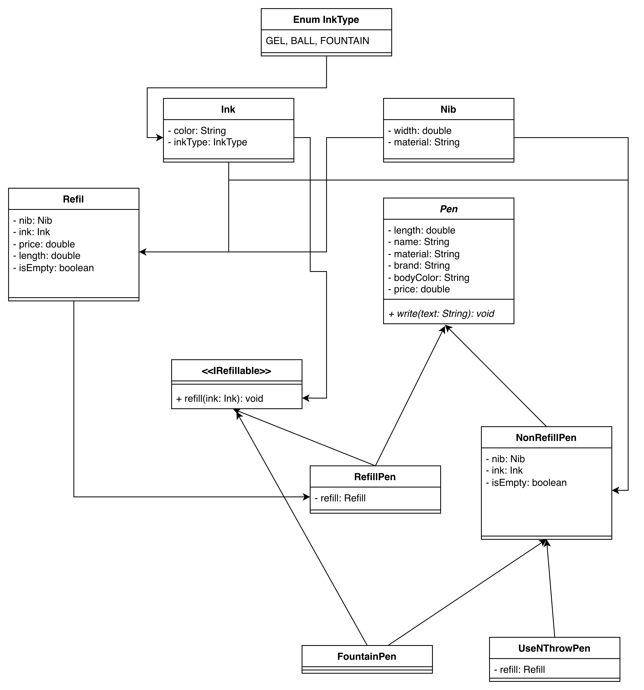

## Step 0-Questions for the interviewer?

2. What exactly do you want me to design?

- Class Diagram
-

2. Should we design for data persistence?

- No

3. How do we interact with the system?

- No interaction

## Step 1—Requirement Gathering

1. Any physical entity that can write with ink is called a pen.
2. Types of pens: Ball, Gel, Fountain.
3. Gel and ball pen contain refill. Refill contains nib and ink.
4. Fountain pen contains nib and ink.
5. Ink can be of multiple colors.
6. Opening mechanisms - cap, click and roll.
7. Pen can be refillable and non-refillable.
8. Pen will different attributes
    - name
    - material
    - brand
    - color
    - price
9. Nib can have different widths.

## Step 2-Class Diagram for pen

Rules -

1. figure out the nouns.
2. visualize from the user journey.

Classes - Ink, Pen, Refill, Nib.

Start with the most basic class.

